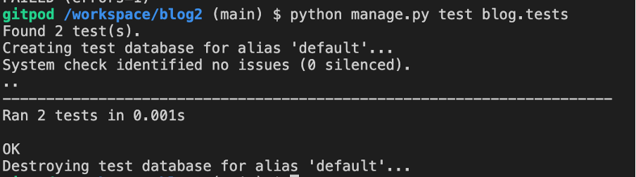

# Book Blog


[Book Blog](https://blog2-8708e1fd0f42.herokuapp.com/) is a site to share book reviews. The site allows users to read about books and to engage in the conversation. 

## Table of contents

* [Purpose](#purpose)
* [UX Design](#ux-design)
* [Wireframes](#wireframes)
* [Design](#design)
* [Features](#features)
* [Data Model](#data-model)
* [Testing](#testing)
* [Technologies](#technologies)
* [Deployment](#deployment)
* [Credits](#credits)

# Purpose
The purpose of Book Blog is to share my passion for literature and reading. The site aims to provide honest, insightful reviews of books so that others can make more informed choices of the books they wish to read. It is also an opportunity to build a community around reading, with users being able to comment on reviews. 

# Agile Development

### GitHub Projects

[GitHub Projects](https://github.com/A-Hebbes/blog2/projects) served as an Agile tool for this project. This project was developed using agile methodologies, following an iterative approach with several sprints. The development process was managed using a GitHub Projects Kanban board to track user stories and tasks. 

### GitHub Issues

[GitHub Issues](https://github.com/A-Hebbes/blog2/issues) served as an another Agile tool.
There, I used my own **User Story Template** to manage user stories.

It also helped with milestone iterations on a weekly basis.

## Epics and User Stories Mapping

The project was organised into epics with their related user stories clearly mapped:

1. **EPIC: User Authentication & Management**
  * USER STORY #1: Account Registration
    - As a site user, I can register an account to enable commenting on posts
    - Acceptance Criteria:
      * Users can register an account using their email
      * Users are able to log in
      * Logged in users are able to leave comments

2. **EPIC: Blog Content Management**
  * USER STORY #2: Draft Management
    - As an admin, I am able to draft posts and then finish them later
  * USER STORY #3: Content CRUD
    - As a site admin, I can perform CRUD operations on posts
  * USER STORY #4: Post Access
    - As a site user, I can access the full text of a post by clicking on its title

3. **EPIC: User Interaction & Comments**
  * USER STORY #5: Comment Management
    - As a site user or admin, I can review comments on posts
  * USER STORY #6: Comment Creation
    - As a site user, I can contribute by leaving comments
  * USER STORY #7: Comment Editing
    - As a site user, I can delete or modify my comments

4. **EPIC: Site Administration**
  * USER STORY #8: Post Management
    - As an admin, I can perform CRUD operations on posts
  * USER STORY #9: Content Preview
    - As a site user, I can see upcoming reviews
    
5. **EPIC: User Interface & Navigation**
  * USER STORY #10: Site Navigation
    - As a user, I can easily navigate through different sections
  * USER STORY #11: Responsive Design
    - As a user, I can access the site on any device

## Agile Implementation

The project was managed using:
- GitHub Projects Kanban board for task tracking
- User stories with defined acceptance criteria
- Regular commits to track progress
- Iterative development cycles

Project board screenshots demonstrate the implementation:


Each user story was moved across the board from 'To Do', through 'In Progress', to 'Done' as development progressed, ensuring a clear visualisation of the project's progress.

# UX Design
## User Stories

As a user:
1. I can view an organised list of previous posts so that I can select and view relevant posts.

   Acceptance Criteria:
   - With multiple posts in the database, the posts will be listed.
   - A list of previous posts is easily visible when the main page is opened.
   - Pagination allows the user to select what they wish to read.

As an admin:
2. I am able to draft posts and then finish them later.

   Acceptance Criteria:
   - Logged in users are able to save draft blog posts.
   - Saved posts can be finished at a later time.

As a site user or admin:
3. I can review comments associated with individual posts to engage in the conversation.

   Acceptance Criteria:
   - Admins can access and review user comments.
   - Site users can navigate to the comment thread to participate in the discussion.

As a site user:
4. I can contribute to the conversation by leaving comments on posts.

   Acceptance Criteria:
   - User comments are approved or disapproved.
   - Once approved, a comment can be replied to.
   - In the case of more than one reply, there will be a conversation function.


As a site user:
5. I can delete or modify my comments on posts.

   Acceptance Criteria:
   - Logged in users can edit their comments.
   - Logged in users can delete their comments.

As a site user:
6. I can register an account to enable commenting on posts.

   Acceptance Criteria:
   - Users can register an account using their email.
   - Users are able to log in.
   - Logged in users are able to leave comments.

As a site admin:
7. I can perform CRUD operations on posts to effectively manage blog content.

   Acceptance Criteria:
   - Site admin can create a new blog post.
   - Site admin can view blog posts.
   - Site admin can update existing blog posts.
   - Site admin can delete blog posts.

As a Site User:
8. I can access the full text of a post by clicking on its title.

   Acceptance Criteria:
   - Upon clicking on a blog post title, the user is presented with a detailed view of the post.

As a site user:
9. I can see what reviews are to be released so that I can know if anything of interest is coming to the site soon.

   Acceptance Criteria:
   - Users can view basic details of blog posts which are currently set as drafts.


## Structure

### Home Page

- The home page displays the site's name and provides a paginated list of blog posts displaying the blog title and creation information. 
    #### User Goal:
    >   - To quickly see a range of posts that can be navigated to easily. 
    >   - To see a navigation menu which can direct to other areas of the site. 
    >   - To be able to click on relevant areas and be accurately taken to where I intend.
    
    #### Website Goal:
    >   - To give users a clear communication of the site's layout. 
    >   - To provide the user key information to use the site effectively. 

### Full Post Page

- This is the page in which readers can view a post and, if logged in, can comment on the post. 
    #### User Goal:
    >   - To read a blog post about a book I may be interested in. 
    >   - If I am logged in, to comment on the posts and provide my input to the conversation. 
    #### Website Goal:
    >   - To clearly display the blog article.
    >   - To give the user the opportunity to comment on posts if they are logged in. 

### Upcoming Post Page

- This page allows to see a list of upcoming posts. 
    #### User Goal:
    >   - To see what future posts are planned so that I can be aware of anything of interest that is upcoming. 
   
    #### Website Goal:
    >   - To display only the basic information of draft posts so that users can be informed of what is coming up. 

### Sign-in / Sign-up Pages

- This page provides the ability for site administration.
    #### User Goal:
    >   - To manage users, posts, and comments.
    >   - To moderate content and control site settings.
   
    #### Website Goal:
    >   - To ensure site access for users and quality content.
    >   - To give admins control over the blog.

### 7. Admin Page

- Gives easy to use site administration
- Allows for management of users, posts, and comments
- Enables easy content moderation and site configuration
- Offers detailed views and filtering options for all models 


# Wireframes


# Design
The design used muted green shades, this aimed to provide a calm environment such as one that would be conducive for reading.
[Coolors](https://coolors.co/) was used to find a good colour palette. 


# Features

## Existing Features

### 1. Blog Post List
- Displays an organized list of blog posts
- Includes pagination for easy navigation

### 2. Full Blog Post View
- Shows full content of a post when title is clicked

### 3. Comments System
- Users can view comments on posts
- Registered users can leave comments
- Users can edit and delete their own comments
- Comments require approval before being displayed

### 4. User Authentication
- User registration functionality
- User login/logout

### 5. Admin Features
- CRUD operations for blog posts
- Ability to save drafts and publish later
- Comment moderation ability

### 6. Upcoming Posts Preview
- Shows a list of upcoming blog posts which are currently in draft


## Future Features

- Category/tag filtering for posts
  - Allows users to find posts related to specific genres/topics.

- User ratings for books
  - Users could rate books on a scale, this will help increase engagemnet and allow other users to get an idea of how popular a book is.

- Newsletter signup
  - Users will be able to subscribe to a newsletter.

- Enhanced user profiles
  - Users could have profiles and the ability to connect with other users. This will allow for users to contact each other about books that have been reviewed and others which also may be of interest.

## Database Schema

The project uses a PostgreSQL database with several interconnected models. Below is the Entity Relationship Diagram (ERD) showing the database structure:


### Core Models

#### Blog Post
The `BlogPost` model is the central model for blog content:
- `title`: Unique title for each blog post
- `slug`: URL-friendly version of the title
- `content`: Main body text of the blog post
- `excerpt`: Short summary of the post
- `created_on`: Timestamp of post creation
- `updated_on`: Timestamp of last update
- `status`: Integer field indicating post status (draft/published)
- `author`: Foreign key to User model
- `tags`: Many-to-many relationship with Tag model

#### Tag
The `BlogTag` model allows for post categorization:
- `name`: Unique name for the tag
- `slug`: URL-friendly version of the tag name
- `created_on`: Timestamp of tag creation

#### Comment
The `BlogComment` model handles user comments:
- `body`: The comment text
- `author`: Foreign key to User model
- `post`: Foreign key to Post model
- `created_on`: Timestamp of comment creation
- `approved`: Boolean field for comment moderation

#### Contact
The `Contact` model stores contact form submissions:
- `name`: Name of the person making contact
- `email`: Email address of the contact
- `message`: Content of the contact message
- `created_at`: Timestamp of message submission

#### Subscriber
The `Subscribers` model manages newsletter subscriptions:
- `email`: Unique email address of the subscriber

### Relationships
- A Blog Post can have multiple Tags (Many-to-Many)
- A Blog Post can have multiple Comments (One-to-Many)
- Each Comment belongs to one Post and one User
- Each Blog Post belongs to one User (author)
- Contact and Subscriber models are standalone with no relationships to other models

### Key Features
- The schema supports a full-featured blog with tagging capabilities
- Comment moderation is supported through the `approved` field
- SEO-friendly URLs are enabled through slug fields
- Timestamps track content creation and updates
- Newsletter subscription functionality is independent of user accounts
- Contact form submissions are stored separately from user data

## ERD Creation 

I have used `pygraphviz` and `django-extensions` to automatically create an ERD.

The steps taken were as follows:
- In the terminal: `sudo apt update`
- then: `sudo apt-get install python3-dev graphviz libgraphviz-dev pkg-config`
- then type `Y` to proceed
- then: `pip3 install django-extensions pygraphviz`
- in my `settings.py` file, I added the following to my `INSTALLED_APPS`:

```python
INSTALLED_APPS = [
    ...
    'django_extensions',
    ...
]
```
- back in the terminal: `python3 manage.py graph_models -a -o erd.png`
- dragged the new `erd.png` file into my `readme/assets/images` folder
- removed `'django_extensions',` from my `INSTALLED_APPS`
- finally, in the terminal: `pip3 uninstall django-extensions pygraphviz -y`

source: [medium.com](https://medium.com/@yathomasi1/1-using-django-extensions-to-visualize-the-database-diagram-in-django-application-c5fa7e710e16)

# Testing

## Manual Testing

### User Interface Elements

#### Navigation Bar
1. Home Link
- Expected: Clicking "Home" navigates to homepage
- Testing: Clicked home link from various pages
- Result: Successfully redirected to homepage
- Fix: No fixes needed

2. Responsive Menu (Mobile)
- Expected: Menu collapses into hamburger on mobile screens
- Testing: Tested on various screen sizes under 768px
- Result: Menu correctly collapses and expands
- Fix: No fixes needed

#### Authentication Features

1. Login Form
- Expected: Users can login with valid credentials
- Testing: Tested with:
 - Valid username/password
 - Invalid username
 - Invalid password
 - Empty fields
- Result: 
 - Valid credentials: Successfully logged in
 - Invalid/empty fields: Appropriate error messages shown
- Fix: No fixes needed

2. Registration Form
- Expected: New users can create accounts with valid details
- Testing: Tested with:
 - Valid information
 - Existing username
 - Non-matching passwords
 - Invalid email format
- Result: Form validation works correctly
- Fix: No fixes needed

#### Blog Features

1. Comment Submission
- Expected: Logged-in users can post comments on blog posts
- Testing: Tested:
 - Submitting valid comment
 - Submitting empty comment
 - Submitting as logged-out user
- Result: 
 - Valid comments posted successfully
 - Empty comments rejected with error message
 - Logged-out users redirected to login
- Fix: No fixes needed

2. Edit Comment Button
- Expected: Users can edit their own comments only
- Testing: Tested editing:
 - Own comment
 - Another user's comment
 - As admin user
- Result: Edit button only appears for own comments and admin
- Fix: No fixes needed

### Responsiveness Testing

Tested on following devices/screen sizes:
1. Desktop (1920x1080)
- Expected: Full layout with sidebar visible
- Testing: Checked all pages and features
- Result: Layout renders correctly
- Fix: No fixes needed

2. Tablet (768px)
- Expected: Responsive layout with collapsed menu
- Testing: Tested navigation and content flow
- Result: Some content overflow on blog posts
- Fix: Added media query to adjust padding on blog containers

3. Mobile (320px)
- Expected: Single column layout, stacked elements
- Testing: Checked all interactive elements
- Result: All elements accessible and functional
- Fix: No fixes needed

## Automated Testing

Automated tests were used to ensure reliability and functionality of key parts of the project. Two test files were created:

### 1. Blog Views Tests (`test_views.py`)

This file holds tests for the blog views:

- `setUp`: Creates a test superuser and a test blog post.
- `test_post_full_with_comment_form`: 
  - Checks if blog post_full view loads as expected.
  - It verifies that post content is displayed.
  - It also ensures that a comment form is on the page.
- `test_successful_comment_submission`:
  - Tests the comment submission users who are logged-in.
  - Checks for a success message after comment submission.

[Views Unit Tests Screenshot](readme/assets/images/views_unit-test.png)
  

### 2. Comment Form Tests (`test_forms.py`)

This file focuses on testing the comment form validation:

- `test_valid_comment_submission`: Makes sure that comments are accepted if they are valid.
- `test_empty_comment_rejection`: Tests to check that empty comments do not get published and that error message shows. 



### Running the Tests

The following command was used to run the tests in the terminal: python manage.py test


## Code Validation

   - Flake8 was used to check python code of the project. 
   - [JSHint](https://jshint.com/) was used to check the JavaScript File. There were no issues raised that required changing.
   - [W3C Validation](https://validator.w3.org/) was used to validate the HTML. Minor issues like unclosed divs and extra spaces in 
      closing tags were fixed. Remaining warnings were related to the use of Django template tags.
   - [W3C CSS Jigsaw](https://jigsaw.w3.org/css-validator/) was used to validate the CSS. No errors were found in the CSS code.

## Lighthouse

There were considerable issues flagged by Lighthouse when the test was run locally. It was not clear to me why these issues were being flagged and the reports I could find seemed to find issues with files that I had not created e.g. bootstrap.css. After attempting to find fixes for the issues and not making progress. I contacted Code Institute tutors for advice. When Lighthouse was run by the tutor, it returned with a far more favourable review of the site. I am still unclear as to why the test was failing locally, other than that it is perhaps that the internet connection where I am presently is unstable. Below are images of the test which I ran locally (white backgorund) and the tutor's screen shot (black background). I hope that this will suffice in this area of the project write up. 


## Technologies Used

### Frontend
- HTML5
- CSS3
- JavaScript (ES6)
- Bootstrap - For responsive design and components
- Font Awesome - For icons
- Google Fonts - For typography

### Backend
- Python 3.12
- Django 4.2.13 - Main web framework
- PostgreSQL - Production database
- SQLite3 - Development database

### Development & Deployment Tools
- Git - Version control
- GitHub - Code repository
- Heroku - Cloud platform for deployment
- VSCode - Code editor
- Django Debug Toolbar - For development debugging
- Coverage.py - For testing coverage reports

### Authentication & Security
- Django Allauth - For user authentication
- Django Crispy Forms - For form rendering


# Deployment

This project was deployed on Heroku using Code Institute's PostgreSQL server. See below for deployment steps:

### Prerequisites

- Python
- Django
- Bootstrap
- Heroku account
- Code Institute PostgreSQL server access

### Database Setup

The database uses the Code Institute server follow the Code Institute guidelines to setup this server. 

### Deployment Process

1. Log in to your Heroku account.
2. On Heroku create a new app.
3. In Heroku app settings add the required environment variables. 
4. Connect the GitHub repository to the Heroku app.
6. The project can be deployed manually or automatically from Heroku. 

### Important Notes

- Ensure `DEBUG` is set to `False` before deployment on Heroku.
- Include the Heroku app in the `ALLOWED_HOSTS` in settings.py.


# Credits

## Code Institute Walkthrough

The code institute project walkthrough 'I Think Therefore I Blog' formed the basis for this project. I used it to guide me through the steps of development and to inform my use of Django and Bootstrap in particular.

## Mentor

Tim Nelson became my mentor after the initial submission of this project, but his advice through my work on project 5 greatly helped in understanding the requirements of this project for resubmission. In particular his advice on creating apps and models was invaluable. Also, his guidance on automatically creating ERDs was of considerable benefit. 


## Course Leader

Laura, my cohort facilitator was a great source of ecouragement and guidance on this project. 

## Tutor Assistance

The Code Institute tutors were also very helpful at a couple of points with this project. Their guidance helped to solve a couple of issues I was having. The guidance and time was very much appreciated.

## AI Assistance
ChatGPT and Claude AI were used to help provide guidance in a number of project areas. In the early stages they were used to develop the blog content, this allowed for the site to be populated with meaningful content whilst also allowing me time to focus on the main job of working on the project. I also used the AI tools mentioned to help provide guidance for debugging when things went wrong. As a novice, I often find that I struggle to know where to begin when a problem occurs. Using the AI tools as a kind of tutor helped to shed light on where issues may have occured.  

## Ollie Grubb
Ollie Grubb gave effective and informative advice on the use of databases. He helped in particular to outline the function of ERDs and how these are useful in the development process. 

## Other Sources of Guidance

The below were used at various points of the project to help guide the development: 

- [W3Schools](https://www.w3schools.com/)
- [Stack Overflow](https://stackoverflow.com/)

## Media

The image of a library was found on [Unsplash](https://unsplash.com/) and was taken by photographer, Janko Ferlic.

